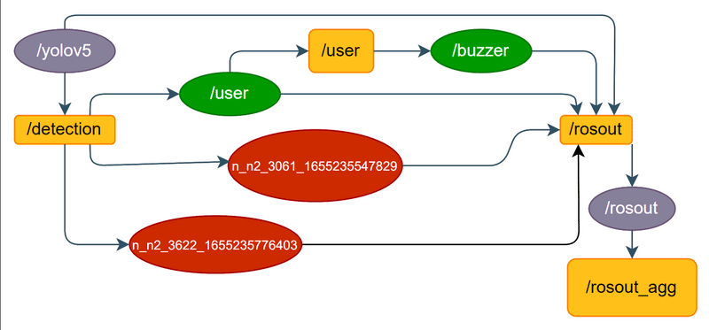
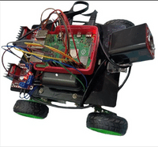
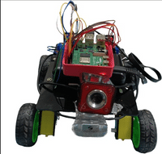

# Intrusion-Detection-Robot-Using-ROS

## Introduction 

An Intrusion Detection Robot is an Electronic Security Solution  that detects unauthorized entry into a Home, Office, Factory, Warehouse, etc.. and alerts the property owner. The Intrusion  Detection Robot consists of a camera and other electronic components working together to provide unparalleled  security. The whole system acts as a barrier to intruders and sends warnings in case of intrusion attempt being made.

## Objective

In our Project, we use Raspberry Pi in combination with ROS to design Four wheeled security Robot that can be controlled by using a laptop or we can just give a predefined path to the robot. The code is in python language using rospy libraries. Generally what the robot does is that when it detects an intruder it sends the message to the client. 

## How to run

On Raspberry Pi, Install Linux Ubuntu Mate and ROS and then run the commands:

```bash
git clone https://github.com/sudi050/intrusion-detection-robot-using-ROS
cd intrusion-detection-robot-using-ROS/Robot
catkin_make
source devel/setup.bash
roslaunch bot yolo.launch
```

On the remote client, Install ROS and then run the commands:

```bash
git clone https://github.com/sudi050/intrusion-detection-robot-using-ROS
cd intrusion-detection-robot-using-ROS/Remote\ Client\ Device
catkin_make
source devel/setup.bash
roslaunch detect detect.launch
```

## Robotic Operating System (ROS)

Robot Operating System (ROS or ros) is an open-source robotics middleware suite. Although ROS is not an operating system (OS) but a set of software frameworks for robot software development, it provides services designed for a heterogeneous computer cluster such as hardware abstraction, low-level device control, implementation of commonly used functionality, message-passing between processes, and package management. Running sets of ROS-based processes are represented in a graph architecture where processing takes place in nodes that may receive, post, and multiplex sensor data, control, state, planning, actuator, and other messages.

ROS Noetic Ninjemys is the thirteenth ROS distribution release. It was released on May 23rd, 2020.ROS Noetic Ninjemys is primarily targeted at the Ubuntu 20.04 (Focal) release, though other systems are supported to varying degrees

## Prerequisites

- Raspberry pi 4  with Ubuntu mate 20.04 lts  os
- ros noetic 
- Two L298N motor driver 
- hd webcam 
- Kit4curious 4-wheeled rover kit.
- Two 9 V batteries
- Power bank (20000mah )
- Buzzer
- Connecting wires ​(8 male – to -male ​,  8 female – to - female ​, 6 female – to - male)

## Flowchart



- **/yolov5** - node responsible for the detection part.
- **/detection** - publisher which will publish all the objects it detects.
- **/user, /n_n2_*_*** - node which subscribes to the /detection topic, and checks if the detected object is a person or not. 
- **/user** - Node with a publisher which will publish no of seconds to sound the buzzer when the detected object is a person.
- **/buzzer** - Node with a subscriber which subscribes to /user and will sound the buzzer whenever needed.
- All the subscribers log the info by publishing it to the **/rosout**

## Algorithm

- Defining a workspace with 4 packages -
- yolo- detects intruders from captured frames and publishes the data.
- bot- subscribes the data from yolo and publish to the remote client and regulates the buzzer.
- buzz- activate the buzzer according to the information from bot.
- move- controls the movement of the rover (remote control or pre-defined path)
- setup file is modified in order to integrate with raspberry pi .
- launch file for activating the system (yolo.launch)-.
- package files are started in the order of detect.py , buzzer.py , user.py, move.py

<p>


</p>


## References

- [https://ubuntu-mate.org/download/arm64/focal/](https://ubuntu-mate.org/download/arm64/focal/)
- [http://wiki.ros.org/noetic/Installation/Ubuntu](http://wiki.ros.org/noetic/Installation/Ubuntu)
- [https://github.com/ultralytics/yolov5](https://github.com/ultralytics/yolov5)
- [https://projects.raspberrypi.org/en/projects/physical-computing/1](https://projects.raspberrypi.org/en/projects/physical-computing/1)
- [https://www.sparkfun.com/datasheets/Robotics/L298_H_Bridge.pdf](https://www.sparkfun.com/datasheets/Robotics/L298_H_Bridge.pdf)
- [https://howchoo.com/g/mjg5ytzmnjh/controlling-dc-motors-using-your-raspberry-pi](https://howchoo.com/g/mjg5ytzmnjh/controlling-dc-motors-using-your-raspberry-pi)
